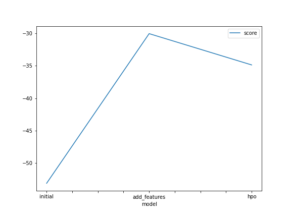
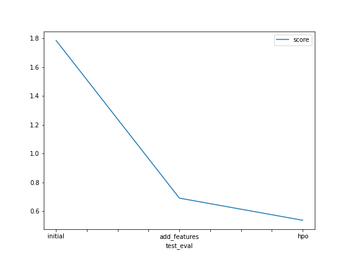

# Report: Predict Bike Sharing Demand with AutoGluon Solution
#### Htoo Wai Yan

## Initial Training
### What did you realize when you tried to submit your predictions? What changes were needed to the output of the predictor to submit your results?
Predictions from the AutoGluton are only for the target column (count). To get a format approved by Kaggle, we need to match the datetime data in the Kaggle sample submission with the predictions.

### What was the top ranked model that performed?
WeightedEnsemble_L2

## Exploratory data analysis and feature creation
### What did the exploratory analysis find and how did you add additional features?
The datetime columns were split into year, month, and day columns. The columns labelled "season" and "weather" are treated as numerical values. Therefore, I converted them to categorical values.

### How much better did your model preform after adding additional features and why do you think that is?
My model performs better after adding the additional features. It is because of the date and time value. Regression model did a better job with the year, month, day column instead of datetime column. I would like to show the difference between the difference of my models. My first model have a score of 1.78649 and last model has 0.53650. So in term of percentage, my last model do  69.96% better than the first model.

## Hyper parameter tuning
### How much better did your model preform after trying different hyper parameters?
My model with hyper parameters scores 0.53650 , which is higher than the previous score with additional features of 0.69036.

### If you were given more time with this dataset, where do you think you would spend more time?
I will refine the features and train the model using a mix of hyper parameters. Instead of just 10 minutes, I'd like to see how the model performs with a much higher time_limit.

### Create a table with the models you ran, the hyperparameters modified, and the kaggle score.
|model|timelimit|presets|problem_type|score|
|--|--|--|--|--|
|initial|600|best_quality|regression|1.78649|
|add_features|600|best_quality|regression|0.69036|
|hpo|600|optimize_for_deployment|regression|0.53650|

### Create a line plot showing the top model score for the three (or more) training runs during the project.

TODO: Replace the image below with your own.

### Create a line plot showing the top kaggle score for the three (or more) prediction submissions during the project.

TODO: Replace the image below with your own.

## Summary
It is most beneficial to work with the features, and you can gain valuable insights from the Exploratory Data Analysis. 
